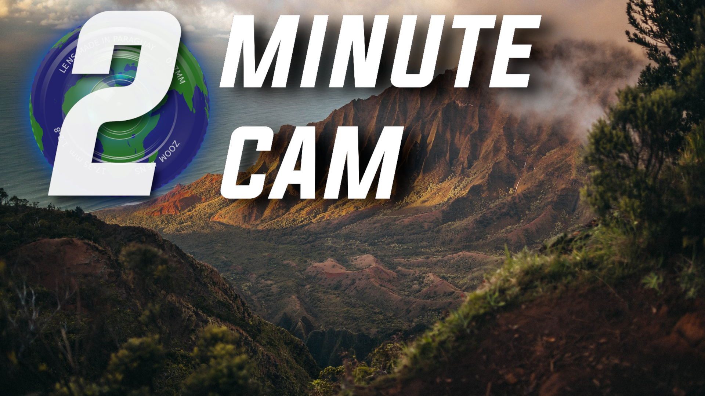
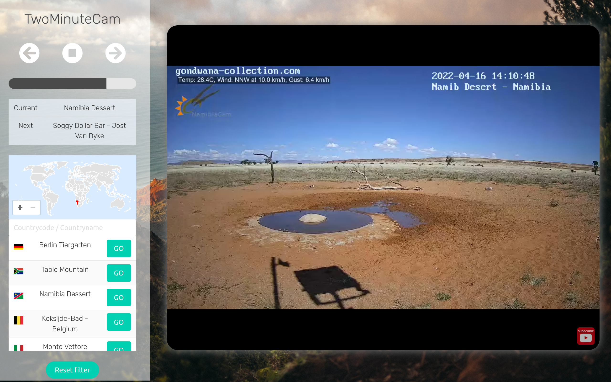

# TwoMinuteCam

  

### This small website provides an easy way to watch YouTube webcams from around the world. 

 <table> <tr> <td style="max-width: 40%"></td> <td style="max-width: 30%"></td> </tr> </table> 
  

## Features:
 * World map for webcam location
 * Every 2 minutes a new webcam 
 * Search for Webcams in countries
 * Simple and modern UI
 * Open source  

## Software used:
 * [Stephan Wagner SVG Map](https://github.com/StephanWagner/svgMap)
 * [Vue JS framework](https://github.com/vuejs/vue)
 * [Bulma CSS framework](https://github.com/jgthms/bulma)
 * [Font Awesome Icons](https://fontawesome.com/)
 * [YouTube iframe-API](https://developers.google.com/youtube/iframe_api_reference)